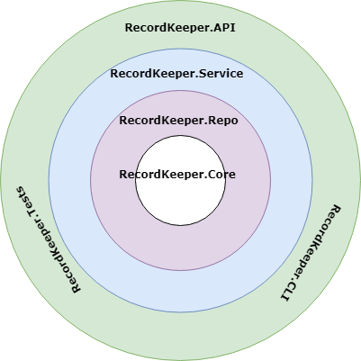

# Record Keeper
A simple record keeping application with a Web API and a CLI

## Solution Structure
To make the application testable and maintainable, the solution was structured using Onion Architecture.
And the concerns are clearly separated into layers.

|Project|Description|
|-------|-----------|
|RecordKeeper.Core | It forms the core of the application. It is meant for the domain entities.|
|RecordKeeper.Repo | This layer is for handling the persistence of data to a database. For now, it would be an in memory data store.|
|RecordKeeper.Service | The layer where the business logic resides.|
|RecordKeeper.API | Restful API for other applications to consume.|
|RecordKeeper.CLI | The interactive command line interface for the application.|
|RecordKeeper.Tests | The test project for unit tests.|
|RecordKeeper.Utility | This layer is home for the utility and the helper classes used by any of the layers.|

